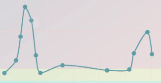

# echarts-touch-sample

Example project to demonstrate touch problem when using echarts on mobile

**Expo sample app:** [https://expo.io/@jonathanrufino/echarts-touch-sample](https://expo.io/@jonathanrufino/echarts-touch-sample)

### The problem

When I try to touch nodes to trigger the tooltip, it only triggers when the center of touch area hits the center of node, if the touch hits the bounds it doesn't get the "touch" event.

